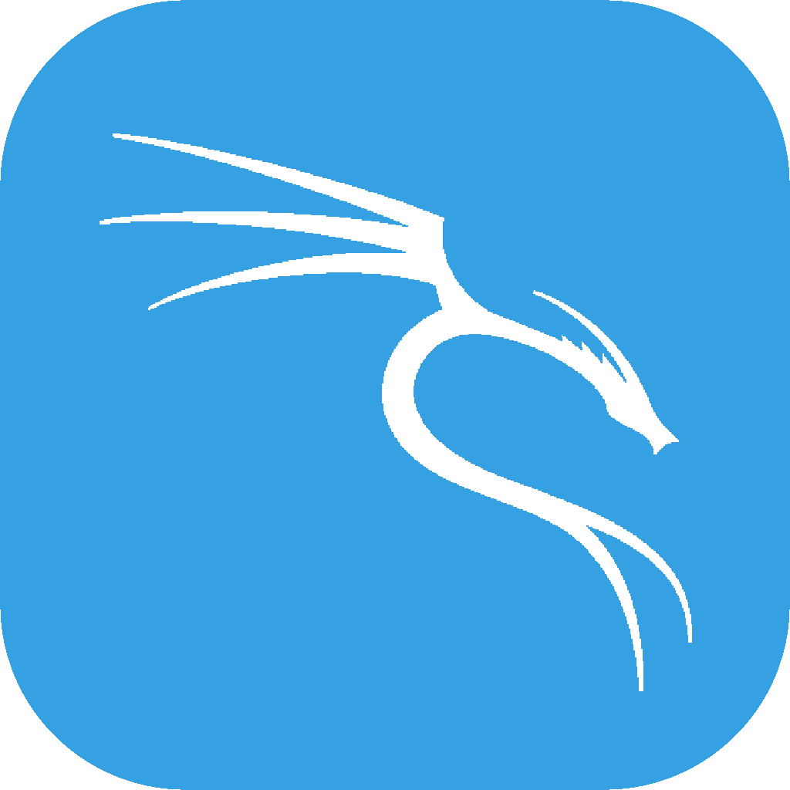
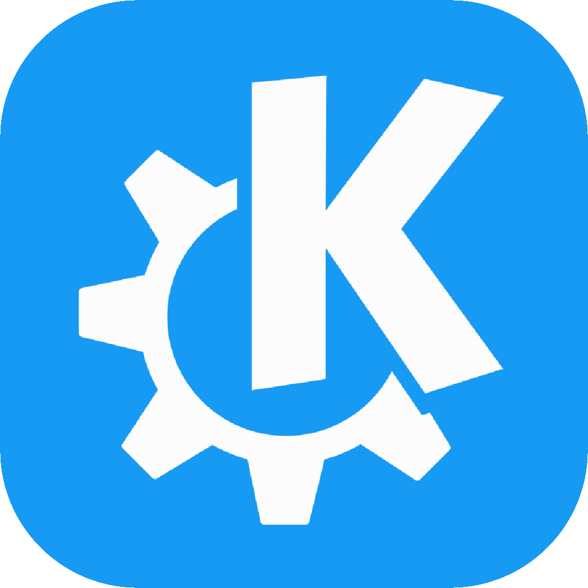

<!--  -->

# 
👋 Hi, I’m <b style="font-weight: 900">@aderepas</b> or you might know me as TKirishima

- 🔭 I’m interested in many topics. I'm very interesred in everything related to science
- 🎮Codingame: <a href="https://www.codingame.com/profile/5aa2aa521102866114371c208d6a45c13550264">TKirishima</a>
- 📫 tkirishima@proton.me
- ⛳ Creator of WeekGolf [ https://week.golf ]

# Languages & Tech
<section style="display: block">
    

## Languages

</section>

## Front

 

## Back

## Design

## Env

## Other

