# 👋 Hi, I’m @aderepas or you might know me as TKirishima
- 🔭 I’m interested in many topics. I'm very interesred in everything related to science
- 🎮Codingame: TKirishima
- 📫 tkirishima@proton.me
- ⛳ Creator of WeekGolf [ https://week.golf ]

# Languages & Tech

## Languages
<!-- Python -->
<a href="https://www.python.org/">
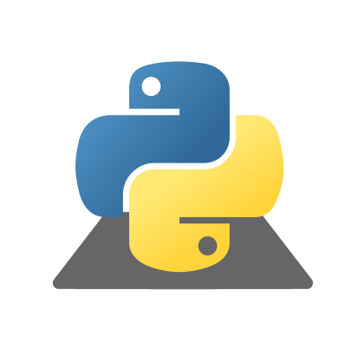
</a>
<!-- C -->
<a href="https://gcc.gnu.org/">
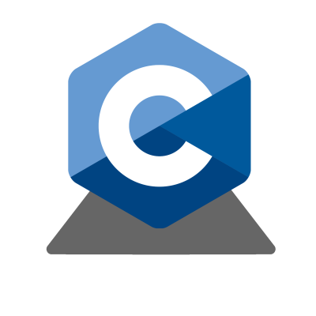
</a>
<!-- C++ -->
<a href="https://clang.llvm.org/cxx_status.html">
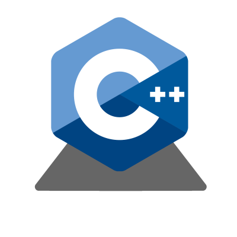
</a>
<!-- C# -->
<a href="https://docs.microsoft.com/en-us/dotnet/csharp/">
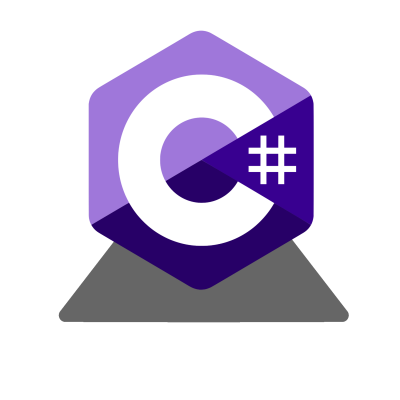
</a>
<!-- Ruby -->
<a href="https://www.ruby-lang.org/en/">
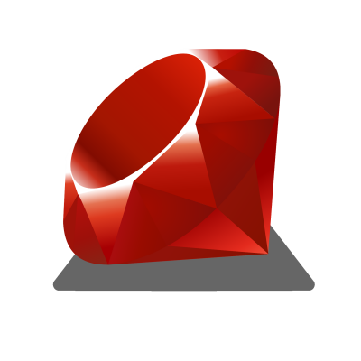
</a>

<!-- HTML -->

<!-- CSS -->
<a href="https://en.wikipedia.org/wiki/CSS">
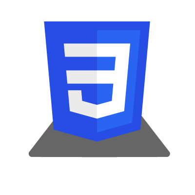
</a>
<!-- JavaScript -->
<a href="https://developer.mozilla.org/en/docs/Web/JavaScript">
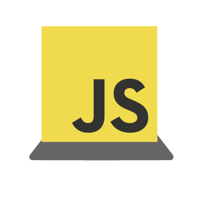
</a>
<!-- PHP -->

## Tech
<!-- MySQL -->
<a href="https://www.mysql.com/">
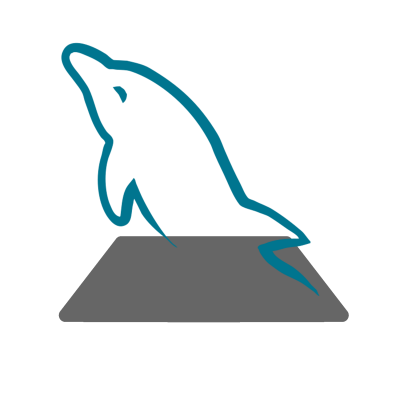
</a>
<!-- Docker -->

<!-- Sélénium -->
<a href="https://selenium-python.readthedocs.io/">
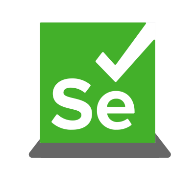
</a>
<!-- VSCode -->
<a href="https://code.visualstudio.com/">
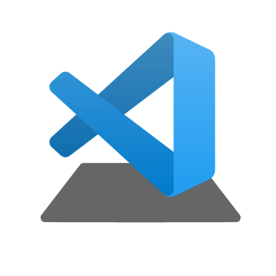
</a>
<!-- Git -->
<a href="https://git-scm.com/">
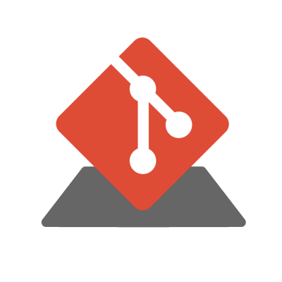
</a>
<!-- Github -->
<a href="https://github.com/">
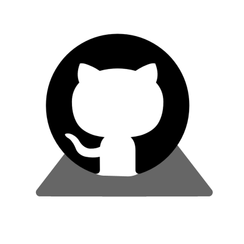
</a>
<!-- Sass -->
<a href="https://sass-lang.com/">
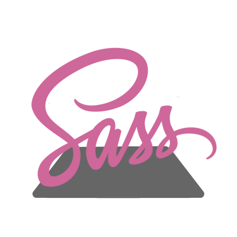
</a>

<!---
aderepas/aderepas is a ✨ special ✨ repository because its `README.md` (this file) appears on your GitHub profile.
You can click the Preview link to take a look at your changes.
--->
